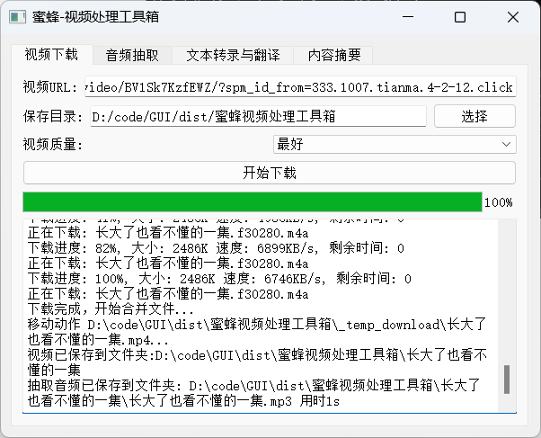
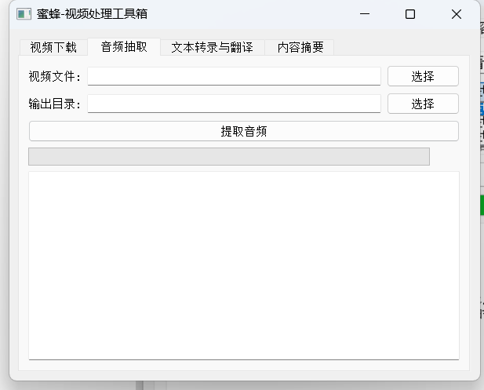
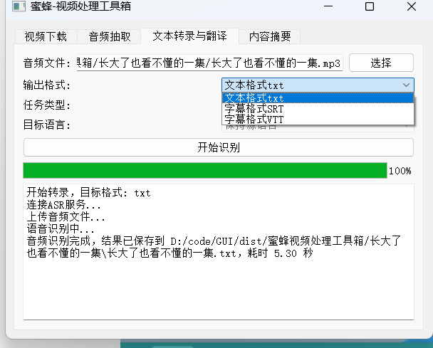
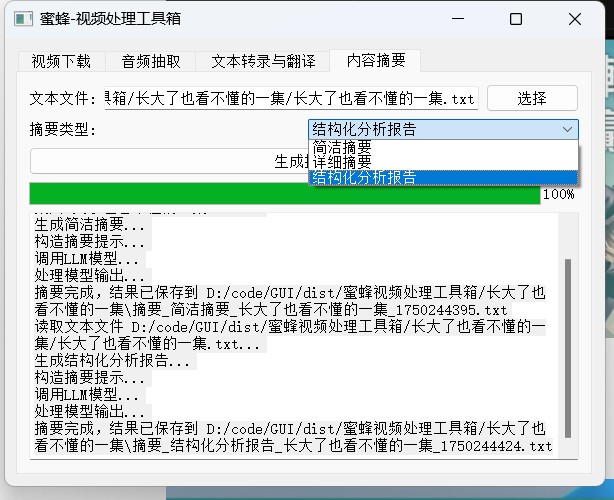
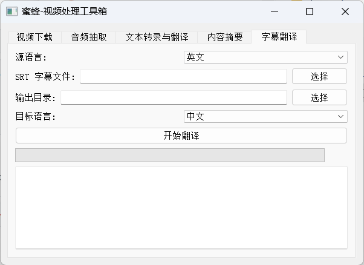

# 🐝 蜜蜂视频处理工具箱

> **蜜蜂视频处理工具箱** 是一个多功能的视频与音频处理工具集，支持从主流平台下载视频、提取音频、语音识别转录、翻译、字幕生成以及文本摘要分析等功能，旨在提升视频内容处理效率。

---

## 📋 目录

- [功能介绍](#功能介绍)
  - [1. 视频下载](#1-视频下载)
  - [2. 音频抽取](#2-音频抽取)
  - [3. 文本转录与翻译](#3-文本转录与翻译)
  - [4. 内容摘要分析](#4-内容摘要分析)
- [安装与配置](#安装与配置)
  - [依赖插件（YouTube 下载）](#依赖插件youtube-下载)
- [使用说明](#使用说明)
- [注意事项](#注意事项)
- [联系方式](#联系方式)

---

## 🧰 功能介绍

### 1. 视频下载
支持从 YouTube、B站 等主流平台下载视频文件（可测试其他平台）。  
- 自动创建以视频名命名的目录。
- 自动抽取音频文件（如 `.mp3`）。
- 下载完成后可直接打开保存目录查看结果。



### 2. 音频抽取
将视频文件转换为音频格式，并压缩体积，便于上传或进一步处理。



### 3. 文本转录与翻译

#### 转录（ASR）
- 支持对音频文件进行语音识别，提取文字内容。 可以自行部署 Whisper Asr Webservice 服务.
- 原语言输出（如法语仍为法语），速度快。

#### 翻译
- 在转录基础上增加翻译功能。
- 支持中英文互译。
- 输出格式：`.txt`、`.srt`、`.vtt`，方便外挂字幕使用。



### 4. 内容摘要分析
- 需要配置大模型 API（详见 `config.ini`）。 可以自行部署ollama 或者标准兼容 openai 的api 即可.
- 支持多种摘要方式，用于快速获取文本核心内容。



### 5. SRT字幕多语言翻译
- 需要配置大模型 API（详见 `config.ini`）。 可以自行部署ollama 或者标准兼容 openai 的api 即可.
- 支持多种语言翻译,目标语言支持英语及中文。实现读取srt字幕文件的逐句翻译.按20个时间轴的合并成一次请求,减少请求量,节省api 调用时间.


---


## ⚙️ 安装与配置

### 依赖插件（YouTube 下载）

为了下载 YouTube 视频，请先安装以下浏览器插件：

🔗 [Get cookies.txt (Locally)](https://chromewebstore.google.com/detail/get-cookiestxt-locally/cclelndahbckbenkjhflpdbgdldlbecc)

安装后：
1. 打开 YouTube 页面；
2. 点击插件图标，点击 `Export`；
3. 将导出的文件复制到工具箱目录下的 `cookies/` 文件夹，命名为：
   ```
   www.youtube.com_cookies.txt
   ```

---

## 📦 使用说明

1. 设置视频/音频保存路径；
2. 开始下载或处理；
3. 处理完成后，自动跳转到保存目录；
4. 若启用 ASR 或摘要功能，需确保已配置好相应 API 接口信息（见 `config.ini`）。

---

## ⚠️ 注意事项

- 插件导出的 `cookies.txt` 必须放置在 `cookies/` 文件夹下，并命名为 `www.youtube.com_cookies.txt`。
- 请定期更新 cookies 文件以保证下载功能正常使用。
- 不同网站可能需要不同的 cookies 文件，请自行扩展支持。
- 根目标需要有一个ffmpeg文件夹. 放置 ffmepg的bin文件.由于web方式无法上传.请从打包文件中提取
- 
---

## 🤝 联系方式

欢迎提出建议、反馈问题或提交 PR！
下载视频只是这个程序的其中一个功能 ,主要是用来视频AI分析.支持从主流平台下载视频、提取音频、语音识别转录、翻译、字幕生成以及文本摘要分析,字幕SRT翻译等功能，主要是提升视频内容处理效率.
大家都可以试试.希望觉得好用就帮我推广和star ,谢谢大家.

📧 微信联系：`flexer`

加微信进 交流群

---

## 📂 项目结构示例

```
bee-video-toolbox/
├── config.ini
├── cookies/
│   └── www.youtube.com_cookies.txt
├── downloads/
│   └── [视频名称]/
│       ├── video.mp4
│       └── audio.mp3
├── README.md
└── tools/
    └── [处理脚本]
```

---

## 📜 开源许可

MIT License  
Copyright (c) 2025 beesoft

---

